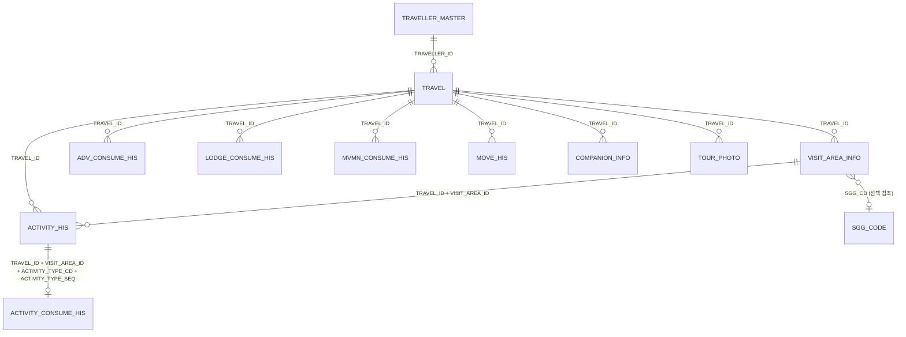

# 2023 수도권 여행로그 데이터 분석 보고서

## Executive Summary

- **짧은 여행에서 현장 활동비가 지출의 중심이다.** 제공된 training 데이터는 2,880개 여행(2023-04-28~2023-09-19)으로, 여행의 92.8%가 2~3일이며 활동 소비가 총 지출의 61.7%를 차지한다.
- **제안할 비즈니스 문제는 ‘짧은 국내여행의 가격 대비 체감가치와 사전 전환 부족’이다.** 여행 단위에서 사전 소비가 0원이 아닌 비율은 20.9%뿐인 반면 활동 소비는 98.8%에서 발생한다. 여행자는 현장에서 활동을 소비하지만, 플랫폼·관광기업은 사전 기획·번들·제휴 전환을 충분히 확보하지 못할 가능성이 크다.
- **기업 액션은 2~3일 수도권 여행용 ‘예산 고정형 마이크로 트립 패스’의 실험이다.** 교통·체험·식음/지역 상점을 묶고, 이탈 직전 가격을 고정해 현장 활동비 일부를 사전 예약으로 이동시킨다. 할인만으로 수요를 만드는 것이 아니라 동선과 예산의 예측 가능성을 판매해야 한다.

## 1. 분석 범위와 데이터 주의사항

- 분석 기준: `여행데이터통합문서_20260730.xlsx`의 제공 training 범위를 집계한 기존 산출 테이블(`travel_summary.csv`, `visit_summary.csv`, `fact_spend.csv`)을 재검산했다.
- 개인정보는 분석 결과에 노출하지 않았고, 집계 수준만 사용했다.
- 명세서(HWP)와 저장 데이터가 완전 동일하지 않다는 사용자 안내를 반영했다. 코드값의 의미, 누락된 테이블/컬럼은 명세서 원본을 최종 기준으로 재확인해야 한다.
- 중요한 제한: 방문지 `체류시간(분)`은 24,154행 모두 0, `만족도`와 `추천 의향`은 전 행 결측이다. 따라서 체류·만족·추천 기반의 성과 판단이나 인과 주장은 하지 않는다.

## 2. 테이블 ERD

| 테이블 | 관측 단위 / 주요 키 | 관계·용도 |
|---|---|---|
| 여행객 Master | 여행객 1명 / `TRAVELLER_ID` | 인구통계 속성, 여행과 1:N |
| 여행 | 여행 1건 / `TRAVEL_ID` | 중앙 fact. 방문·소비·이동·동반자·사진과 1:N |
| 방문지 정보 | 여행-방문지 / `TRAVEL_ID`, `VISIT_AREA_ID` | 동선의 핵심. 활동과 1:N |
| 활동 이력 | 방문지-활동 / 4개 복합키 | 활동 소비와 1:0..1로 검증해 결합 |
| 활동/사전/숙박/이동 소비 | 결제/소비 행 | `TRAVEL_ID`로 여행 지출에 집계 |
| 이동 이력·동반자·관광사진 | 각각의 이벤트 행 | `TRAVEL_ID` 기준 보조 fact |
| 시군구 코드 | 지역 코드 | 지역 속성 lookup |

## 3. 간단 EDA

| 항목 | 결과 | 해석 |
|---|---:|---|
| 여행 수 / 여행객 수 | 2,880 / 2,880 | 이 제공 범위에서는 여행객당 1개 여행 |
| 방문지 행 수 | 24,154 | 원시 방문 기록 기준 |
| 여행당 평균 방문지 수 | **8.387곳** | 중앙값 7곳으로, 평균은 일부 다방문 여행의 영향을 받음 |
| 여행기간 | 2일 1,935건(67.2%), 3일 738건(25.6%) | 2~3일이 92.8%인 단기 여행 표본 |
| 총 지출 | 681,958,908원 | 제공 소비 이력의 합계 |
| 여행당 지출 | 평균 236,791원 / 중앙값 145,250원 | 평균이 중앙값보다 1.63배여서 고지출 여행의 영향이 큼 |
| 성별 | 여성 1,667명(57.9%), 남성 1,213명(42.1%) | 표본 구성이지 수도권 전체 여행객 비율은 아님 |
| 연령대 | 20대 1,062명, 30대 999명 | 20~30대가 71.6%로 분석 표본의 중심 |

### 소비 구조

| 소비 항목 | 금액 | 총지출 비중 | 결제 행 | 0원 결제 행 |
|---|---:|---:|---:|---:|
| 활동 소비 | 420,692,408원 | **61.7%** | 13,275 | 78 (0.59%) |
| 숙박 소비 | 128,784,315원 | 18.9% | 843 | 59 (7.00%) |
| 이동 소비 | 91,485,299원 | 13.4% | 4,624 | 15 (0.32%) |
| 사전 소비 | 40,996,886원 | 6.0% | 716 | 25 (3.49%) |

### 금액 관련 컬럼의 0원 행 수

**결제 행 기준**(원천 소비 이력의 `PAYMENT_AMT_WON`): 총 **177행**이다. 위 소비 구조 표의 항목별 0원 결제 행을 합산한 값이다.

**여행 단위 집계 기준**(해당 항목 소비가 전혀 없는 여행):

| 여행 단위 금액 컬럼 | 0원 여행 수 | 비율 |
|---|---:|---:|
| 사전 소비(원) | 2,279 | 79.1% |
| 숙박 소비(원) | 2,172 | 75.4% |
| 이동 소비(원) | 231 | 8.0% |
| 활동 소비(원) | 34 | 1.2% |
| 총지출(원) | 1 | 0.03% |

두 기준은 의미가 다르다. 결제 행의 0원은 무료·취소·기록 규칙을 점검할 데이터 품질 이슈이고, 여행 단위의 0원은 해당 소비 항목의 미이용/미기록 여부를 뜻한다.

## 4. 비즈니스 문제: 단기 국내여행의 ‘예산 확신’과 사전 전환이 약하다

### 외부 근거

- 2025년 국내여행을 계획한 직장인의 평균 휴가 예산은 535,000원으로 전년보다 9.4% 증가했다는 조사 보도가 있었다. 비용 상승은 국내여행에서도 가격 대비 가치와 예산 예측 가능성을 중요한 구매 기준으로 만든다. [Korea JoongAng Daily, 2025-06-30](https://koreajoongangdaily.joins.com/news/2025-06-30/business/economy/Korean-workers-turn-to-local-getaways-as-travel-costs-rise/2341895)
- 정부·관광공사도 2025년 국내 숙박 수요를 늘리기 위해 대규모 숙박 할인쿠폰을 시행했다. 이는 단순 수요 회복뿐 아니라 가격 부담을 낮추는 상품 설계가 필요한 시장 신호다. [Korea JoongAng Daily, 2025-05-21](https://koreajoongangdaily.joins.com/news/2025-05-21/culture/foodTravel/Korean-govt-launching-discounts-on-hotels-to-encourage-domestic-travel/2312226)
- 한편 2025년 국내여행 경험률은 회복됐지만 해외여행 경험률도 역대 최고 수준으로 상승했다. 국내 상품은 ‘갈 곳이 있다’만으로는 충분하지 않고, 가격·동선·경험을 묶은 비교 가능한 가치를 제시해야 한다. [Korea JoongAng Daily / Yonhap, 2026-03-31](https://koreajoongangdaily.joins.com/news/2026-03-31/business/industry/Travel-demand-rebounds-to-prepandemic-levels-in-2025-while-outbound-travel-hits-new-high-Data/2557975)

### 데이터가 보여주는 기회

1. **상품의 시간 단위가 명확하다.** 2~3일 여행이 92.8%이므로 ‘긴 일정’보다 1박2일/2박3일의 표준화된 상품이 적합하다.
2. **소비의 핵심은 활동이다.** 활동 소비가 61.7%이므로, 숙박만 할인하는 방식보다 체험·입장·지역 식음·교통을 연결해 현장 비용을 줄이는 구성이 고객 가치와 매출에 더 직접적이다.
3. **사전 소비 전환에 빈 공간이 있다.** 사전 소비가 발생한 여행은 601건(20.9%)에 그친다. 이는 사전예약이 실제로 불필요하다는 증거는 아니지만, 기업 입장에서는 사전 상품화·제휴·추천이 활동 지출을 충분히 포착하지 못했을 수 있다는 강한 가설이다.

## 5. 기업 액션 플랜: ‘수도권 마이크로 트립 패스’ 실험

| 단계 | 실행 | 측정 KPI | 의사결정 기준 |
|---|---|---|---|
| 1. 상품 설계 (0~4주) | 2일·3일 일정별로 교통+핵심 활동 1~2개+지역 제휴 혜택을 묶고, 총 예상금액을 예약 시점에 고정 | 패스 노출 대비 상세조회율, 가격 이탈률 | 일정/가격대별 수요 탐색 |
| 2. 전환 실험 (5~10주) | 일반 추천 대비 ‘예산 고정 패스’ A/B 테스트. 20~30대, 2~3일 일정부터 시작 | 사전 구매율, 객단가, 활동 제휴 attach rate | 사전 소비 발생률 20.9% 대비 유의미한 상승 확인 |
| 3. 지역 파트너 확장 (11~16주) | 활동비 비중이 큰 카테고리의 공급자부터 수수료·쿠폰을 공동 설계 | 파트너당 순매출, 쿠폰 비용 대비 증분 GMV, 취소율 | 할인 의존 없이 단위경제가 맞는 파트너만 확장 |
| 4. 운영 고도화 | 예약 후 일정 리마인드, 혼잡/영업정보, 대체 제휴처 제안 | 노쇼율, 일정 변경 후 재예약률, CS 건수 | ‘예산 확신’과 동선 편의가 실제 경험을 개선하는지 판단 |

### 반드시 함께 설계할 데이터 수집

- 방문지별 실제 체류시간과 만족도/추천 의향을 정상 수집한다. 현재 제공 데이터로는 상품 품질을 평가할 수 없다.
- `사전 소비`가 예약·선결제·취소·무료 쿠폰 중 무엇인지 상태값을 분리한다.
- 목적 코드와 방문지 유형 코드의 코드북을 모델/대시보드에 연결한다.
- 지출은 결제금액 외에 할인 전 금액, 쿠폰 부담 주체, 수수료, 취소/환불을 분리해 순매출 기준으로 측정한다.

## 6. 결론과 주의사항

우선순위는 **할인 확대 자체가 아니라, 단기 수도권 여행에서 활동비를 예측 가능하게 묶어 사전 전환시키는 것**이다. 이 표본은 2023년 수도권 training 데이터이므로 현재 시장 규모나 전국 여행객 전체로 일반화할 수 없으며, 뉴스는 시장 맥락을 제공할 뿐 이 데이터의 인과관계를 증명하지 않는다. 첫 실행은 제한된 일정·지역·파트너를 대상으로 한 A/B 실험으로 시작하고, 사전 구매율·증분 순매출·취소율을 함께 확인해야 한다.
